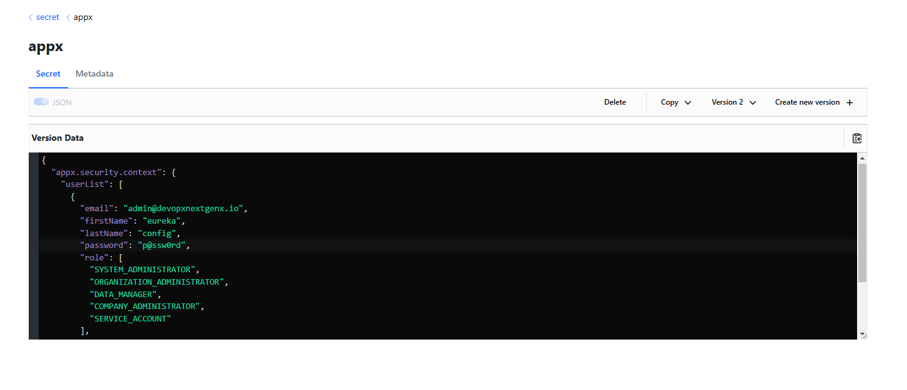

# app-core-modules

### Start localstack and mysql server

```bash
cd localstack
docker compose up -d
```

### Setup Keystore

```bash
# For Linux, find cacerts and use that path
sudo keytool -importcert -alias appx -file appx-services/app-eureka-config-service/src/main/resources/appx.crt -keystore /etc/ssl/certs/java/cacerts -storepass changeit

# For Windows, Open terminal as admin, find the JDK involved and use path accordingly
keytool -delete -alias appx -keystore "c:/Program Files/Zulu/zulu-17/lib/security/cacerts" -storepass changeit
keytool -importcert -alias appx -file appx-services/app-eureka-config-service/src/main/resources/appx.crt -keystore "c:/Program Files/Zulu/zulu-17/lib/security/cacerts" -storepass changeit
```
### Package and Install

```bash
mvn clean install
# Skip tests
mvn clean install -DskipTests
```

### Data Setup for Seed User

- Enable vault container with localstack
- Open [vault](http://localhost:8200/) and login with `00000000-0000-0000-0000-000000000000` token
- Add below data to `secret` engine with `appx` Path
    ```json
    {
        "appx.modules.security.context": {
            "userList": [
            {
                "email": "admin@devopsnextgenx.io",
                "firstName": "eureka-vault",
                "lastName": "config-vault",
                "password": "p@ssw0rd",
                "roles": [
                "SYSTEM_ADMINISTRATOR",
                "ORGANIZATION_ADMINISTRATOR",
                "DATA_MANAGER",
                "COMPANY_ADMINISTRATOR",
                "SERVICE_ACCOUNT"
                ],
                "username": "admin"
            }
            ]
        },
        "appx.modules.security.jwtSecret": "vaultSecret",
        "appx.modules.security.truststore.password": "appxxppa",
        "spring.security.oauth2.client.registration.github.client-id": "<client-id>",
        "spring.security.oauth2.client.registration.github.client-secret": "<client-secret>",
        "spring.security.oauth2.client.registration.github.scope": "user:email,read:user",
        "spring.security.oauth2.client.registration.google.client-id": "<client-id>",
        "spring.security.oauth2.client.registration.google.client-secret": "<client-id>",
        "spring.security.oauth2.client.registration.google.redirect-uri": "https://react.appx.localtest.me:5000/",
        "spring.security.oauth2.client.registration.google.scope": "email,profile"
    }
    ```
- Finally it should look like as below.

    

### Start Services

```bash
# Start Registry/Config server
cd appx-services/app-eureka-config-service
mvn spring-boot:run

# Start app-user-auth-service
cd appx-services/app-user-auth-service
mvn spring-boot:run

# Start app-user-auth-service
cd appx-services/user-service
mvn spring-boot:run
```

### Import XML Data
- Open `Swagger UI` for [User Auth Service](https://user-auth-service.appx.localtest.me:2001/swagger-ui/index.html)
    - Use `user/password` or `config/password` as Basic Authentication to generate jwt token
    - Use generated token to set `JWT token` to invoke respective endpoints
    - Run `ImportXml` endpoint with `INCREMENTAL` or `OVERRIDE` to create default users

### Other generic instructions

- Open [Eureka Dashboard](https://eureka-config-service.appx.localtest.me:8761/) with `admin/p@ssw0rd`
- Open `Swagger UI` for [User Service](https://user-service.appx.localtest.me:8080/swagger-ui/index.html)
    - Use `user/password` or `admin/p@ssw0rd` as Basic Authentication to generate jwt token
    - Use generated token to set `JWT token` to invoke respective endpoints

- With `jwt-token-generator`, Use user `admin/admin` or `user/user` for generating jwt token using 
- With `demo-controller`, Use JWT token to access protected endpoints